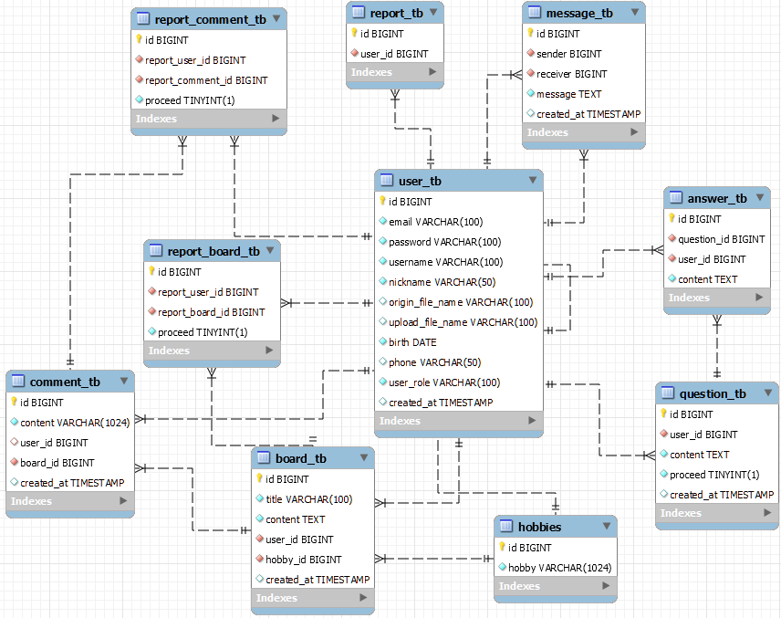

# 취미 공유 커뮤니티 게시판

## 사용한 spring & java 기술

- spring boot & MyBatis   
- spring web MVC    
- 기본 게시판 구현    
- 암호화 처리    
- interceptor 처리    
- JSP, Jstl 태그 라이브러리    
- Validation 처리    
- Exception Handler 처리    
- Resource Handler 처리 
- enum & reflection

---
## stack

     
     
     
     
     

---
## os

--- 
## IDE

---
## community

---

### 1일차 (2022-04-26)
- 개발환경 설치 및 기본 코드 작성
    - Spring Boot 2.7.1 설치
    
    - application.yml, build.gradle 설정
    
    - 데이터베이스 설계 및 생성(ERD => 수정 끝 최종본)
    
### 2일차 (2022-04-27)
- UTF-8 Error 수정
    - STS HTML & CSS & JSP 설정 추가
- 기본 템플릿(Header, Footer) css 작성
    - 기본이 되는 템플릿 작성
- 회원 추천시스템 구상
    - 어떠한 방식으로 회원에게 알맞은 추천을 할 수 있는지에 대한 고민
- 회원 구현(회원가입)

- 게시판 구현(작성, 수정, 삭제)

### 3일차 (2022-04-28)
- 취미 데이터베이스 입력
    - 실제 존재하는 취미들을 데이터베이스에 넣는 작업 진행(이 때의 노가다를 통해 더미데이터 코드 작성의 필요를 느낌)
- 회원 구현 마무리(로그인, 로그아웃, 회원탈퇴, 비밀번호변경, 아바타업로드(파일업로드))

- 게시판 구현 마무리(게시판 취미, 로그인 세션연결)

- 관리자페이지 구현(유저관리, Q_A(답변))

- 회원 추천로직 개발(협업 필터링 기반 구현)
    - List를 통해 반환(순서는 섞일 수 있으나 리스트를 받을 때 우선도 순위는 다음과 같음)
        - 나이별로 추천(우선도 上)
        - 비슷한 나이별 해당 취미를 가지고 있다면 추천추가(우선도 最上) 
        - 비슷한 취미별로 추천(우선도 中)

- 회원 추천 로직 js를 통해 받아오기(Javascript fetch기능 사용)

- 게시판 댓글 구현(작성, 수정, 삭제)
### 4일차 (2022-05-01)
- 쪽지기능 구현

- 전체적인 css 디자인

- 더미 글쓰기 코드 구현
    - 데이터베이스에 더미데이터를 집어넣기위해 코드 작성 (추천시스템 테스트)
### 5일차 (2022-05-02)
- 관리자 로직 마무리
    - 신고글이나 댓글 확인 후 삭제 및 신고누적 카운팅 기능추가
    - 누적이 3회이상이면 해당 유저는 자동으로 정지
- css 마무리

- ppt 제작
